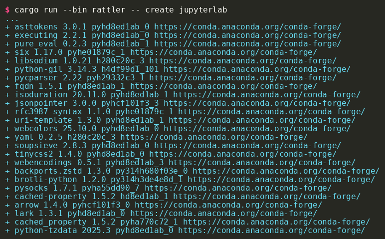

<a href="https://prefix.dev/tools/rattler/">
  
</a>

# Rattler: Rust crates for fast handling of conda packages

![License][license-badge]
[![Build Status][build-badge]][build]
[![Project Chat][chat-badge]][chat-url]
[![Pixi Badge][pixi-badge]][pixi-url]
[![docs main][docs-main-badge]][docs-main]
[![python docs main][py-docs-main-badge]][py-docs-main]

[license-badge]: https://img.shields.io/badge/license-BSD--3--Clause-blue?style=flat-square
[build-badge]: https://img.shields.io/github/actions/workflow/status/conda/rattler/rust-compile.yml?style=flat-square&branch=main
[build]: https://github.com/conda/rattler/actions
[chat-badge]: https://img.shields.io/discord/1082332781146800168.svg?label=&logo=discord&logoColor=ffffff&color=7389D8&labelColor=6A7EC2&style=flat-square
[chat-url]: https://discord.gg/kKV8ZxyzY4
[docs-main-badge]: https://img.shields.io/badge/rust_docs-main-yellow.svg?style=flat-square
[docs-main]: https://conda.github.io/rattler
[py-docs-main-badge]: https://img.shields.io/badge/python_docs-main-yellow.svg?style=flat-square
[py-docs-main]: https://conda.github.io/rattler/py-rattler
[pixi-badge]:https://img.shields.io/endpoint?url=https://raw.githubusercontent.com/prefix-dev/pixi/main/assets/badge/v0.json&style=flat-square
[pixi-url]: https://pixi.sh

**Rattler** is a powerful Rust library and set of components designed to handle conda packages natively, providing common functionality used throughout the conda ecosystem ([what is conda & conda-forge?](#what-is-conda--conda-forge)).

Our mission is to enable programs and other libraries to effortlessly interact with the conda ecosystem without being locked into a Python dependency. With Rattler, you get high performance, strong type safety, and seamless integrations in non-Rust projects through our extensive language bindings.

Rattler powers cutting-edge tools including [pixi](https://github.com/prefix-dev/pixi), [rattler-build](https://github.com/prefix-dev/rattler-build), and the robust backend of [prefix.dev](https://prefix.dev).

## 🚀 Showcase

Experience the speed and simplicity of Rattler firsthand. The repository includes a binary that demonstrates installing a complex environment—complete with Python and `jupyterlab`—*entirely from scratch*:


### Terminal Output
Check out this screenshot showing the command in action right from our terminal:



## 🛠️ Installation & Usage on Your Local PC

Ready to start using Rattler on your machine? Follow these step-by-step instructions for Windows, macOS, and Linux to clone, compile, and run the project.

### Prerequisites
Make sure you have the following installed before beginning:
- **Git:** [Download here](https://git-scm.com/book/en/v2/Getting-Started-Installing-Git)
- **Pixi:** [Installation instructions](https://pixi.sh/latest/) (for simple cross-platform setup)
- **Rust Toolchain:** Optional, but useful if you want to compile with `cargo` directly. Install via [rustup](https://rustup.rs/).

### Step 1: Clone the Repository
Clone the repository and its submodules to get started. Open your terminal (or Command Prompt/PowerShell on Windows) and run:

```bash
git clone --recursive https://github.com/conda/rattler.git
cd rattler
```

### Step 2: Compile and Run
You have two ways to run Rattler locally—either using `pixi` or via standard `cargo`. Both will download and install a fully functioning `jupyterlab` environment inside the `.prefix` directory.

**Option A: Using Pixi (Recommended)**
```bash
pixi run rattler create jupyterlab
```

**Option B: Using Cargo (Rust)**
```bash
cargo run --bin rattler --release -- create jupyterlab
```

### Step 3: Launch JupyterLab
Once the environment is successfully installed, launch JupyterLab right away.

**On Windows:**
```powershell
.\.prefix\Scripts\jupyter-lab.exe
```

**On macOS / Linux:**
```bash
./.prefix/bin/jupyter-lab
```

*Voilà!* You now have a working installation of JupyterLab managed entirely by Rattler. You can use this method to install any package you need.

## 🐍 Python and Javascript Bindings

Unlock the power of Rattler directly in your Python and Javascript projects! We provide incredibly fast, clean, and comprehensive bindings so you can solve environments, install packages, and execute commands from your language of choice.

### Python

Install the Python bindings (`py-rattler`) effortlessly via pip or conda:

```bash
pip install py-rattler
# or
conda install -c conda-forge py-rattler
```

Dive into the [Python bindings documentation](https://conda.github.io/rattler/py-rattler/) to explore the full API.

<details>
  <summary><strong>Example: Using Rattler with Python <code>asyncio</code></strong></summary>

```python
import asyncio
import tempfile

from rattler import solve, install, VirtualPackage

async def main() -> None:
    print("Started solving the environment...")
    solved_records = await solve(
        channels=["conda-forge"],
        specs=["python ~=3.12.0", "pip", "requests 2.31.0"],
        virtual_packages=VirtualPackage.detect(),
    )
    print("Solved required dependencies!")

    env_path = tempfile.mkdtemp()
    await install(
        records=solved_records,
        target_prefix=env_path,
    )
    print(f"Created environment: {env_path}")

if __name__ == "__main__":
    asyncio.run(main())
```
</details>

### Javascript

For the web and Node.js, `rattler` is compiled to WebAssembly. Install it via npm:

```bash
npm install @conda-org/rattler
```

These bindings are actively used by tools like [`mambajs`](https://github.com/emscripten-forge/mambajs) to solve and install packages directly *in the browser*.

## 🧩 Components

Rattler is modular, consisting of several crates that provide specific functionalities across the ecosystem:

* **rattler_conda_types**: Foundational types for all conda datastructures.
* **rattler_package_streaming**: Download, extract, and create conda package archives.
* **rattler_repodata_gateway**: Gateway to download, read, and process repodata indices.
* **rattler_shell**: Code to activate environments and execute programs within them.
* **rattler_solve**: A backend-agnostic satisfiability solver.
* **rattler_virtual_packages**: Detect capabilities of the host system.
* **rattler_index**: Create local conda channels from packages.
* **rattler**: Core library integrating all the above to create environments.
* **rattler-lock**: Creation and parsing of conda lockfiles.
* **rattler-networking**: Network operations (authentication, mirroring, etc.).
* **rattler-bin**: An example package manager utilizing all the crates (see: [Showcase](#showcase)).

Find these in the `crates` folder.

## 📖 Project Evolution & History

Rattler has grown significantly since its inception. Here is a brief look back at the key milestones and evolutionary steps that brought the project to where it is today:

* **Nov 2021:** Project initialized! The foundations were laid out with initial commits focused on basic conda version parsing and core setups (`initial commit`, `feat: parsing of conda version`).
* **Feb 2022:** Core functionality started taking shape. Important features like parsing version specs (`feat: parsing of version specs`) and downloading repodata (`feat: downloading of repodata`) were introduced.
* **Mar 2022:** A massive milestone: the dependency solver began functioning! (`resolve is sort of working!`). Crucial work went into multi-version constraint sets and resolving infinite loops during the solving process.
* **Jul 2022:** Transitioned to standard CLI tooling using `clap` (`refactor: move to clap`). Added significant continuous integration support (`feat: ci`) to ensure project stability.
* **Aug 2022:** The libsolv solver was integrated (`feat: adds libsolv solver`), dramatically enhancing solving capabilities. Data models for extracting channel information were added.
* **Late 2022 to Present:** Continued massive expansion. New features include extracting packages directly from URLs, detecting virtual packages, moving foundational types into a separate crate (`rattler_conda_types`), package validation, and async extraction methods. Binding support for Python (`py-rattler`) and Javascript propelled Rattler into a multi-language toolchain.

## 🤝 Contributing 😍

We welcome contributions of all shapes and sizes! Please check out our [CONTRIBUTION.md](CONTRIBUTION.md) to get started.

If you have questions, feature requests, or just want to chat, we have a highly active community on Discord. [Join our server here!][chat-url]

## ❓ What is conda & conda-forge?

The conda ecosystem provides **cross-platform**, **binary** packages that you can use with **any programming language**.
`conda` is an open-source package and environment management system capable of installing and managing multiple software versions and dependencies. While `conda` itself is written in Python, **Rattler** aims to provide all the underlying functionalities directly in Rust, allowing integration into other languages. Rattler is a *library*, not a reimplementation of `conda` (which is a CLI tool).

`conda-forge` is a community-driven repository that brings tens-of-thousands of up-to-date software packages into the conda ecosystem. Check out [prefix.dev](https://prefix.dev) to explore them!
